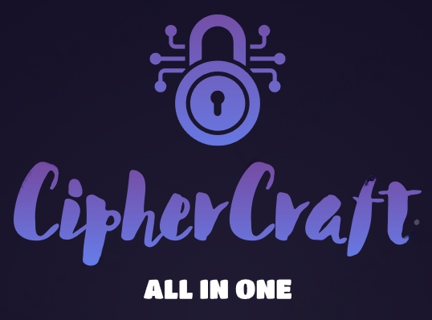

# CipherCraft



**CipherCraft** is a powerful Python-based cryptography tool with a command-line interface, offering a wide range of classic and modern cryptographic algorithms.

## Table of Contents

- [Description](#description)
- [Installation](#installation)
- [Usage](#usage)
- [Contributors](#contributors)
- [License](#license)

## Description

CipherCraft is designed to provide a convenient and versatile environment for cryptographic operations. Whether you are working with classic algorithms like Caesar cipher or modern ones like AES or RSA, CipherCraft has you covered. The tool supports encryption, decryption, key generation.

## Installation

To install CipherCraft, follow these steps:

1. Clone the repository:

    ```bash
    git clone https://github.com/oufkirIbrahim/CipherCraft
    ```
   
   Or this one

   ```bash
    git clone https://github.com/codeonym/CipherCraft
    ```

2. Navigate to the project directory:

    ```bash
    cd CipherCraft
    ```

3. Install the tool in editable mode:

    ```
   pip install .
   ```

   This will install CipherCraft from the current directory.

## Usage

Once installed, CipherCraft can be accessed via the command line. Here's a basic example:

```bash
ciphercraft-cli
```

For detailed instructions on how to use specific algorithms, operations, and features, refer to the [official documentation](docs/documentation.md).

## Contributors

CipherCraft is the result of collaborative efforts. The following contributors have played a significant role in the project:

- [Oufkir Ibrahim](https://github.com/oufkirIbrahim)
- [Bouarour Ayoub](https://github.com/codeonym)

We welcome contributions from the community to make CipherCraft even more powerful and feature-rich.

## License

CipherCraft is open-source and released under the [MIT License](LICENSE). Feel free to explore, modify, and distribute the code as per the terms of the license.~~
